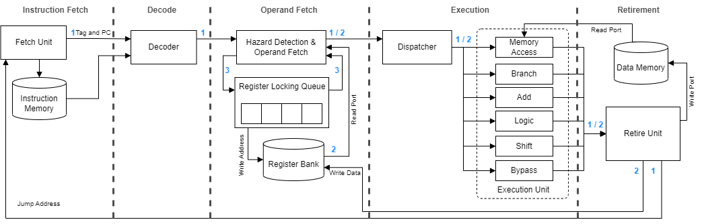

# PUCRS-RV

### Description 

PUCRS-RV is a processor that implements the RISC-V 32 bits integer Module (RV32I). It was written in a Hardware Description Language (HDL) called SystemVerilog.

This project was designed at the Embedded Systems Group (GSE) of the polytechnic school, PUCRS, Brazil.

The processor is a 5 stage pipeline, synchronized to the rising edge of clock. The stages are:

- Fetch: Contains the Program Counter (PC) Logic, that indexes the Instruction memory.
- Decoder: Decodes the instruction, extracting it's type, format, operantion and register addresses.
- Operand Fetch: Fetches the operands in the register Bank and performs data hazards detections. When a hazard is detected, it insert bubbles until the conflict has been solved.
- Execute: Performs the given operation on the received operands. It has 6 units where each one is responsible for one kind of operation, such as shift operantions are performed in "Shift Unit" or memory instructions are performed by "Memory Unit".
- Retire: Make the retirement of the instructions, it can be a write-back in register bank, or performing a write in data memory or performing a branch.

> PUCRS-RV BLOCK DIAGRAM.

## Requirements

To perform code compilation the RISC-V toolchain is needed. The toolchain has a compiler that performs the compilation of the applications codes that are written in C language and generates a binary, this binary is the entry of the processor simulation. The applications are located in [app/](https://github.com/Willian-Nunes/pucrs-rv/tree/master/app).

The installation of the toolchain is only needed if you want to compile new applications or change parameters in the given ones, the given applications are already compiled and it's binarys are located in the folder [bin/](https://github.com/Willian-Nunes/pucrs-rv/tree/master/bin).

To install the Toolchain a guide and a script are provided inside the folder [tools/riscv-toolchain](https://github.com/Willian-Nunes/pucrs-rv/tree/master/tools/riscv-toolchain).

To perform the simulation you must have a HDL simulator (e.g. ISE, MODELSIM). To perform the simulation of a specific application, you must edit the binary input file in the [ram.sv](https://github.com/Willian-Nunes/pucrs-rv/blob/master/sim/ram.sv) (the line to be edited is inside the "initial" block and is located in the line 54. The tesbench and the ram implementation are located in the [/sim](https://github.com/Willian-Nunes/pucrs-rv/blob/master/sim/) folder. Once the desired application is selected and the testbench is pointing to it, then you are able to perform the simulation using the HDL simulator. 

## RTL and Processor Organization

This processor organization is based in an Asynchronous RISCV High-level Functional Model written in GO language. That can be found in [ARV](https://github.com/marlls1989/arv).

The processor is a 5 stage pipeline, synchronized to the rising edge of clock and is characterized by three main loops that controls the processor flow.

- First Stage: 
The first stage is the is the Fetch Stage and is implemented by the [Fetch Unit](https://github.com/Willian-Nunes/pucrs-rv/blob/master/rtl/fetch.sv), this unit contains the Program Counter (PC) logic, the value contained in this register is used to index the intruction memory, at each clock cycle it is updated, it can be updated to the following instruction address (PC+4), or to a branch address, it can alo mantain the same address in case of a bubble being inserted due to a detection of a data hazard. The jump/branch prediction policy is "never taken".
Each instruction that leaves the first stage is linked to a Tag that will follow the instruction until the last stage. This Tag indicates the flow of that instruction. Every time a jump/branch occurs the tag will be increased meaning that the fetched instrctions now belong to a new flow.

- Second Stage:
The second stage comprehend the [Decoder Unit](https://github.com/Willian-Nunes/pucrs-rv/blob/master/rtl/decoder.sv), It is responsible for the generation of the control signals, based in the instruction object code fetched by the last stage. The first signal decoded by this unit is the instruction type (e.g. addi, bne), based on this it then generate the signal that indexex the execute unit responsible for that kind of operation and also the number of operation that the execute unit must perform. It also decodes the instruction format (e.g. Immediate, Branch).

- Third Stage:
The Third stage is the Operand Fetch Stage and is implemented by the [Operand Fetch Unit](https://github.com/Willian-Nunes/pucrs-rv/blob/master/rtl/operandFetch.sv). This unit is responsible for sending to the register bank the read addresses that are directly extracted from the instruction object code, the object code is also used for the immediate operand extractiong, based in the instruction format. The instruction format also determines the operands that will be sent to the next stage. 

This unit also implements the Data Hazard Detection mechanism, for that, it uses a queue of blocked registers, registers with pending writes, this queue receive a new entry at every time that a instruction leaves the stage, the value inserted is the Destiny register (regD) of the given instruction, in a one-hot format (each bit of the signal represents a register of the register bank). This queue have the lenght of the remaining stages in the pipeline (2 in this case), each position of the queue is merged into a OR operation generating a mask that indicates the blocked registers (registers with pending writes). A Data Hazard is detected when the instruction being processed by the operand fetch stage have a operator that must be read from one of the blocked registers, this issues a signal called "bubble" that indicates that bubbles must be issued until the data conflict gets resolved. This unit also look for data memory hazards, cases where a read is performed right after a write in memory, for that it uses the bit zero of the regD one-hot signal, since it is a dont care, once register bank zero register is read only. 
The same queue used to detect the hazard is used to generate the register bank write-enable, the last position of the queue holds the index of the register that must receive the write-back. This signal is bitwised in a AND operation with the write enable received from the fifth stage. 

- Fourth Stage:
This stage comprehends the [Execute Stage](https://github.com/Willian-Nunes/pucrs-rv/blob/master/rtl/execute.sv), this stage instantiates the six execution units (adder, bypass, branch, logic, memory and shift). Each unit receives data to be processed only when the instruction type corresponds to it kind of operation, for example, the adder unit only receives the operands when the instruction types are ADD(I), SUB(I and SLT(U), in every other instruction it will be assigned to a High impedance state ('Z). This behaviour is implemented by a dispatcher that only dispatch the instruction to the designed unit and keep all the other units in 'Z' state. The execution units after receiveing the opperands and the operation, perform the computation and output the result. At the end of the stage is a demultiplexer that forward to the next stage only the results of the instruction that performed the operation.

- Fifth Stage:
The fifth and last stage is responsible for the retirement of the instructions, it is implemented by the [Retire Unit](https://github.com/Willian-Nunes/pucrs-rv/blob/master/rtl/retire.sv) the instructions that enter this stage first have a flow validation, this validation is made by a comparison of the instruction tag and the Retire Tag, if they are equal it means that the instruction is valid (belongs to the same Flow), otherwise it means that after the instruction was fetched a jump/branch occured and the flow was changed to a new one, this means the instruction must be discarded. Every time a jump/branch occurs the internal tag is increased and in the next cycle the Tag of the Fetch stage will also be increased to match.
This unit is responsible for performing the action of the instructions, this actions are performed the signals issued by this unit, that are 3 possible actions: 
1) Write-back operantion in the register bank - performed by sending the "write enable" signal and the "data" to be written.
2) Jump/Branch operation in the fetch unit - performed by sending the "jump" signal and the jump/branch address.
3) Write operation in the memory - performed by sending the "data", the "write enable" and the "write address" sginals.

### The three loops

The Control of the processor flow is made by three main loops:

1) The first loop is the outermost loop that comprehends the entire processor, it starts in the first stage and goes throght until the fifth stage where it is closed by the control signals that are sent back to the first stage, this loop is implemented by the Tag system that manages the retirement of the instructions, it is uptaded every time a jump/branch occurs. It is closed by the Retire Unit.

2) The second loop comprehends the third, the fourth and the fifth stage, it is called the Datapath loop and implements the data write-back in the register bank. It is closed by the Retire Unit.

3) The third loop comprehends the data hazard conflict mechanism that is implemented by the queue of register with pending writes.

## Applications
In this repository we provide some applications that were used to validate the processor. The source codes of the applications are located the [app/](https://github.com/Willian-Nunes/pucrs-rv/tree/master/app) folder, all of them can be built using their own Makefile, it will generate the output binary of each application. We recommend moving it to the [bin/](https://github.com/Willian-Nunes/pucrs-rv/tree/master/bin) folder using a cp command. Inside the [bin/](https://github.com/Willian-Nunes/pucrs-rv/tree/master/bin) folder all the given applications are already compiled and ready to simulate its behaviour.

### Coremark
The [Coremark](https://github.com/Willian-Nunes/pucrs-rv/tree/master/app/coremark) is a Benchmark application that was develop by EEMBC, it was ported to run in PUCRS-RV and can be compiled by simply running the command "make" insede Coremark's folder, it will then generate a binary called "coremark.bin". In our processor since we have only one thread we are running the coremark for only one iteration.

### RISCV Tests
The [riscv-tests](https://github.com/marlls1989/riscv-tests/tree/159079a82ecc332ce32e5db84aff9f814dc7ec12) is the "Berkeley Suite" that was developed to validate the RISC-V implementations. It tests all the instructions by running comparisons between the expected results and those generated by the Unit under verification.

### Sample Codes
The [samplecode](https://github.com/Willian-Nunes/pucrs-rv/tree/master/app/samplecode) folder contains some simple applications that were used to test some functionalities in the processor. These applications use the BareOS, that is a simple Operational System. All the applications are compiled at once by simple running "make" command. To add more applications you must insert in the folder the source code in C language and then edit the [Makefile](https://github.com/Willian-Nunes/pucrs-rv/blob/master/app/samplecode/Makefile) so it also compiles the new application, to do that, is just needed to edit the line 13 of the Makefile by adding the name of the new application on the "PROGNAME" variable, that is a list of the applications that will be make.

The applications provided are:
1. Dummy - Test the halt function of the processor.
2. Hello World - Test the "stdout" of the processor, by printing "Hello World".
3. Hanoi Tower - Implements a Hanoi Tower solving algoritm.
