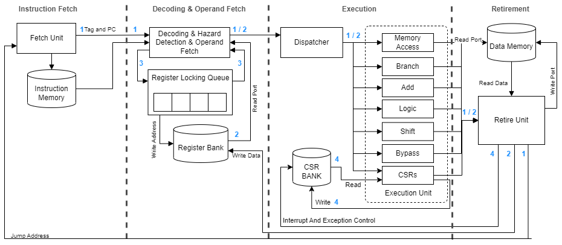
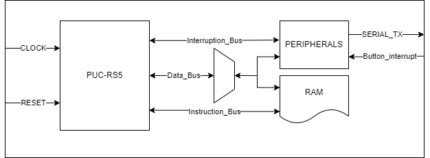

# PUC-RS5

### Description 

PUC-RS5 is a processor that implements the RISC-V 32 bits integer Module (RV32I) alongside with the Zicsr Extension and the Machine Mode of the RISC-V Privileged Architecture. It is written in the SystemVerilog Hardware Description Language (HDL) and implements the following interface:

This project was designed at the Hardware development support Group (GAPH) of the School of Technology, PUCRS, Brazil.

The processor is a 4 stage pipeline, synchronized to the rising edge of clock. The stages are:

- Fetch: Contains the Program Counter (PC) Logic, that indexes the Instruction memory.
- Decode and Operand Fetch: Decodes the instruction, extracting it's type, format, operation and register addresses, also Fetches the operands in the register Bank and performs data hazards detections. When a hazard is detected, it insert NOP instructions (bubbles) until the conflict become resolved.
- Execute: Performs the given operation on the received operands. It has 7 units where each one is responsible for one kind of operation, such as shift operations are performed in "Shift Unit" or memory instructions are performed by "Memory Unit".
- Retire: Make the retirement of the instructions, it can be a write-back in register bank, or performing a write in data memory or performing a branch.

> PUC-RS5 BLOCK DIAGRAM.

## RTL and Processor Organization

This processor organization is an evolution of an Asynchronous RISC-V High-level Functional Model written in GO language. That can be found in the [ARV Go High-level Functional Model](https://github.com/marlls1989/arv) repository.

- First Stage: 
This stage is the the Fetch Stage and is implemented by the [Fetch Unit](https://github.com/gaph-pucrs/PUC-RS5/blob/master/rtl/fetch.sv), this unit contains the Program Counter (PC) logic, the value contained in this register is used to index the instruction memory, at each clock cycle it is updated, it can be updated to the following instruction address (PC+4), or to a branch address, it can also maintain the same address in case of a bubble being inserted due to a detection of a data hazard. The jump/branch prediction policy is "never taken".
Each instruction that leaves the first stage is linked to a Tag that will follow the instruction until the last stage. This Tag is a number that indicates the "flow/context" of that instruction. Every time a jump/branch occurs the tag will be increased meaning that the fetched instructions now belong to a new flow.

- Second Stage:
It comprehend the [Decoder Unit](https://github.com/gaph-pucrs/PUC-RS5/blob/master/rtl/decode.sv), It is responsible for the generation of the control signals, based in the instruction object code fetched by the last stage. The first signal decoded by this unit is the instruction operation (e.g. addi, bne), this signal contains in its encoding the execute unit responsible for that kind of operation and also the operation that the execute unit must perform. It also decodes the instruction format (e.g. Immediate, Branch). This unit is also responsible for sending to the register bank the read addresses that are directly extracted from the instruction object code, the object code is also used for the immediate operand extraction, based in the instruction format. The instruction format also determines the operands that will be sent to the next stage. The Data Hazard Detection mechanism is inside this unit, it uses a queue of blocked registers, registers with pending writes, this queue receive a new entry at every time that a instruction leaves the stage, the value inserted is the Destiny register (regD) of the given instruction. This queue have the length of the remaining stages in the pipeline (2 in this case), each position of the queue indicates the blocked registers (registers with pending writes). A Data Hazard is detected when the instruction being processed by the decoding stage have a operator that must be read from one of the blocked registers, this issues a signal called "hazard" that indicates that bubbles must be issued until the data conflict gets resolved. This unit also look for data memory hazards, cases where a read is performed right after a write in memory. 
The same queue used to detect the hazard is used to generate the register bank write-enable, the last position of the queue holds the address of the register that must receive the write-back data.

- Third Stage:
This stage comprehends the Execute Stage that is implemented by the [Execute Unit](https://github.com/gaph-pucrs/PUC-RS5/blob/master/rtl/execute.sv), this stage instantiates the seven execution units (adder, bypass, branch, logic, memory, shift and CSR access). Each unit receives data to be processed from a dispatcher that dispatches the instruction to the units. The execution units after receiving the operands and the operation, perform the computation and output the results. At the end of the stage exists a de-multiplexer that select the result from the correct unit and forward it to the next stage.

- Forth Stage:
This is the last stage and it is responsible for the retirement of the instructions, it is implemented by the [Retire Unit](https://github.com/gaph-pucrs/PUC-RS5/blob/master/rtl/retire.sv) the instructions that enter this stage first have a flow validation, this validation is made by a comparison of the instruction tag and the Retire Tag, if they are equal it means that the instruction is valid (belongs to the same Flow/Context), otherwise it means that after the instruction was fetched a jump/branch occurred and the flow/context changed to a new one, this means the instruction must be discarded. Every time a jump/branch occurs the internal tag is increased and in the next cycle the Tag of the Fetch stage will also be increased to match when the branch is effectively taken.
This unit is responsible for performing the action of the instructions, this actions are performed by the signals issued by this unit, that are 4 possible actions: 
1) Write-back operation in the register bank - performed by sending the "write enable" signal and the "data" to be written.
2) Jump/Branch operation in the fetch unit - performed by sending the "jump" signal and the jump/branch address.
3) Write operation in the memory - performed by sending the "data", the "write enable" and the "write address" signals.
4) CSR operations - Observes the CSR bank flags and CSR instructions operations to perform operations such as raising exceptions, acknowledging interruptions and performing privilege switch instructions such as MRET.

### The three loops

The Control of the processor flow is made by three main loops:

1) The first loop is the outermost loop that comprehends the entire processor, it starts in the first stage and goes through until the fourth stage where it is closed by the control signals that are sent back to the first stage, this loop is implemented by the Tag system that manages the retirement of the instructions, it is updated every time a jump/branch occurs. It is closed by the Retire Unit.

2) The second loop comprehends the seconde, the third and the fourth stage, it is called the Datapath loop and implements the data write-back in the register bank. It is closed by the Retire Unit.

3) The third loop comprehends the data hazard conflict mechanism that is implemented by the queue of register with pending writes.

### Memory Interface

The processor implements The memory interface depicted in the above image. The Memory is a True dual port RAM where one port is used as a read-only port for instruction fetching and the other port is used read and write operations.

## Requirements

To perform code compilation the RISC-V toolchain is needed. The toolchain has a compiler that performs the compilation of the applications codes that are written in C language and generates a binary, this binary is the entry of the processor simulation. The applications are located in [app/](https://github.com/gaph-pucrs/PUC-RS5/tree/master/app).

The installation of the toolchain is only needed if you want to compile new applications or change parameters in the given ones, the given applications are already compiled and it's binaries are located in the folder [bin/](https://github.com/gaph-pucrs/PUC-RS5/tree/master/bin).

To install the Toolchain a guide and a script are provided inside the folder [tools/riscv-toolchain](https://github.com/gaph-pucrs/PUC-RS5/tree/master/tools/riscv-toolchain).

To perform the simulation you must have a HDL simulator (e.g. ISE, MODELSIM). To perform the simulation of a specific application, you must edit the binary input file in the [ram.sv](https://github.com/gaph-pucrs/PUC-RS5/blob/master/sim/ram.sv) (the line to be edited is inside the "initial" block and is located in the line 54. The testbench and the ram implementation are located in the [/sim](https://github.com/gaph-pucrs/PUC-RS5/tree/master/sim) folder. Once the desired application is selected and the testbench is pointing to it, then you are able to perform the simulation using the HDL simulator. 

## Applications
In this repository we provide some applications that were used to validate the processor. The source codes of the applications are located the [app/](https://github.com/gaph-pucrs/PUC-RS5/tree/master/app) folder, all of them can be built using their own Makefile, it will generate the output binary of each application. We recommend moving it to the [bin/](https://github.com/gaph-pucrs/PUC-RS5/tree/master/bin) folder using a cp command. Inside the [bin/](https://github.com/gaph-pucrs/PUC-RS5/tree/master/bin) folder all the given applications are already compiled and ready to simulate its behavior.

### Coremark
The [Coremark](https://github.com/gaph-pucrs/PUC-RS5/tree/master/app/coremark) is a Benchmark application that was develop by EEMBC, it was ported to run in PUCRS-RV and can be compiled by simply running the command "make" inside Coremark's folder, it will then generate a binary called "coremark.bin". In our processor since we have only one thread we are running the coremark for only one iteration.

### RISCV Tests
The [riscv-tests](https://github.com/marlls1989/riscv-tests/tree/159079a82ecc332ce32e5db84aff9f814dc7ec12) is the "Berkeley Suite" that was developed to validate the RISC-V implementations. It tests all the instructions by running comparisons between the expected results and those generated by the Unit under verification.

### Sample Codes
The [samplecode](https://github.com/gaph-pucrs/PUC-RS5/tree/master/app/samplecode) folder contains some simple applications that were used to test some functionalities in the processor. These applications use the BareOS, that is a simple Operational System. All the applications are compiled at once by simple running "make" command. To add more applications you must insert in the folder the source code in C language and then edit the [Makefile](https://github.com/gaph-pucrs/PUC-RS5/blob/master/app/samplecode/Makefile) so it also compiles the new application, to do that, is just needed to edit the line 13 of the Makefile by adding the name of the new application on the "PROGNAME" variable, that is a list of the applications that will be make.

The applications provided are:
1. Dummy - Test the halt function of the processor.
2. Hello World - Test the "stdout" of the processor, by printing "Hello World".
3. Hanoi Tower - Implements a Hanoi Tower solving algorithm.

### Prototyping

This processor is designed to be prototyped in FPGA environments. In the [proto/](https://github.com/gaph-pucrs/PUC-RS5/tree/master/proto) folder there is the designed environment for prototyping. The prototyping was made in a Vivado environment and the folder includes a Vivado ".xpr" project that includes all the required files for replication.

The prototyping Environment is shown in the figure below. This environment is implemented by the [PUC_RS5_With_BRAMs.sv](https://github.com/gaph-pucrs/PUC-RS5/blob/master/proto/PUC_RS5_With_BRAMs.sv) module. This module instantiates the PUC-RS5 core and implements the memory using Block Rams, the PUC-RS5 also count with a compiler "ifdef" macro to use a LUT RAM Register Bank to optimize FPGA resource usage. There is a module that implements the core peripherals that will be discussed in next subsection. The peripheral access is made through data memory interface and the peripherals are mapped in memory in addresses that are higher than the memory length, that in this case is 64Kbs.

> PUC-RS5 Environment DIAGRAM.

## Peripherals

The peripherals module implement some components that are depicted in image below.
The peripherals can issue interruptions that will request attention from processor core through a interrupt request signal (IRQ).
The peripheral module is composed by two main interfaces, the first one is for data access and is used for reads and writes in peripherals and the second one is the one related to interruption request generation.
The PUC-RS5 counts with a Real Time clock that can be read by direct access and also raises an interrupt every 5 seconds.
In the FPGA a physical button is mapped to an environment entry that will detect the button press event and raise a interrupt request for the core.
The Environment count with a universal asynchronous receiver-transmitter (UART) that enables the processor to communicate with other devices through serial protocols. This UART is mapped to the serial that is connected in the host computer and implements the standard output for print operations. To increase throughput the serial is preceded by a FIFO buffer.

> PUC-RS5 Peripherals DIAGRAM.

### Trap treatment flow

> PUC-RS5 Trap treatment flow Diagram.