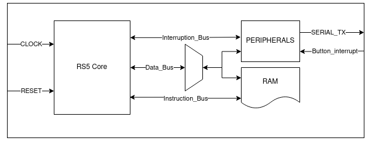
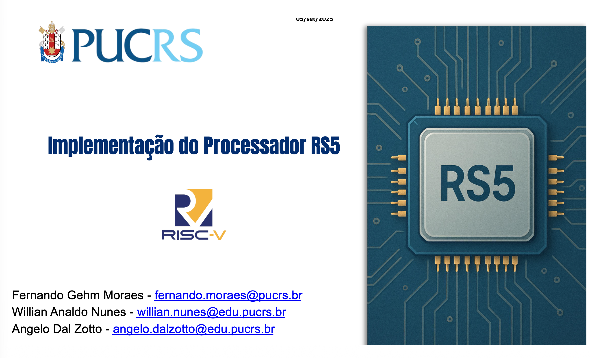
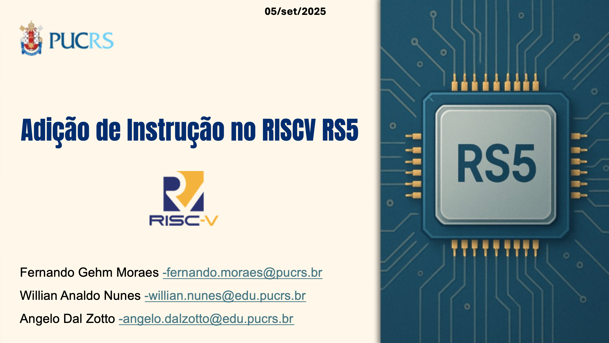
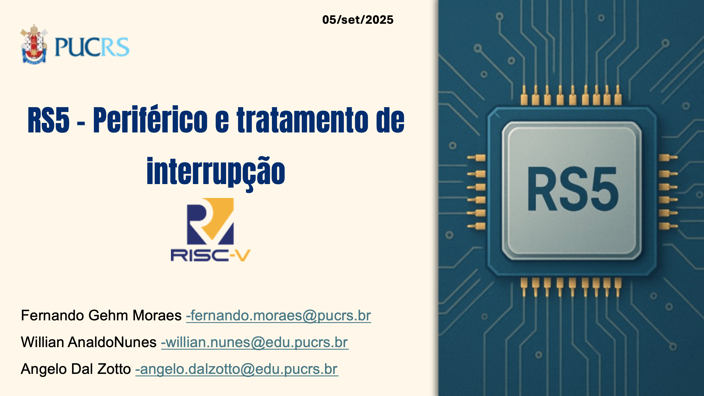

# RS5

**RS5** is a parameterizable, 4-stage pipelined RISC-V processor written in SystemVerilog, developed at the [Hardware Design Support Group (GAPH)](https://nsesd.pucrs.br/), PUCRS, Brazil.

[](riscof/README.md)
[](proto/RS5)
[](proto/RS5_SUME)
[](https://www.linkedin.com/feed/update/urn:li:activity:7470952399667425280/)


[](LICENSE)

## Table of Contents

- [RS5](#rs5)
  - [Table of Contents](#table-of-contents)
  - [Feature overview](#feature-overview)
  - [Simulation Quick Start](#simulation-quick-start)
    - [Requirements](#requirements)
    - [Build the test application](#build-the-test-application)
    - [Simulate with Verilator](#simulate-with-verilator)
    - [Simulate with Modelsim/Questa](#simulate-with-modelsimquesta)
    - [Simulate with Xcelium](#simulate-with-xcelium)
  - [FPGA Prototyping](#fpga-prototyping)
    - [Prototyping steps](#prototyping-steps)
  - [Architectural compliance (RISCOF)](#architectural-compliance-riscof)
  - [Tutorials (in Portuguese)](#tutorials-in-portuguese)
  - [Cite this work](#cite-this-work)
  - [Acknowledgements](#acknowledgements)

---

## Feature overview

| Feature | Details |
|---|---|
| Base ISA | RV32I |
| Privilege modes | Machine mode (M-mode) and User mode (U-mode) |
| Interrupt controller | optional [SiFive-compliant](https://github.com/riscv/riscv-plic-spec) [PLIC](rtl/plic.sv) |
| Machine timer | optional [mtimer](rtl/rtc.sv) |

| Extension type | Available extensions |
|---|---|
| Integer extensions | Zicond; Zicsr (always enabled); Zihpm |
| Multiply/divide extensions | M or Zmmul (multiply subset) |
| Atomic extensions | A, Zalrsc (conditional subset), or Zaamo (AMO subset) |
| Compressed extensions | C and Zcb (additional compressed) |
| Cryptography | Zkne (AES), Zbkb (bit-manip), Zknh (SHA2), Xkyber(Kyber) |
| Vector extension | Zve32x and Zvl64b subsets (configurable VLEN, LLEN) |
| Non-standard | Xosvm (offset and size virtual memory support) |

| Parameter | Details |
|---|---|
| Branch prediction | Optional static branch prediction for immediate branches at decode stage |
| Data forwarding | Optional forwarding from execution result or memory read. Register writeback is always forwarded. |
| Instruction buffering | Optionally fetches while pipeline is stalled |

Optional features are configurable through parameters in [rtl/RS5.sv](rtl/RS5.sv).
See [docs/README.md](docs/README.md) for details on the core implementation, parameters and extensions.

---

## Simulation Quick Start

### Requirements

It is possible to evaluate RS5 using only open source tools:

- [Verilator](https://verilator.org)
- [RISC-V toolchain](https://github.com/gaph-pucrs/Memphis-V/blob/master/docs/riscv.md)

RS5 also supports simulation with the following commercial tools:
- Modelsim/Questa
- Xcelium

### Build the test application

The default test application is a set of tests from the [riscv-arch-test](https://github.com/riscv/riscv-arch-test).
You need to build the application before running the simulation:

```bash
make -C app/riscv-tests
```

### Simulate with Verilator

This verilates and runs the default application.
Results are written to `sim/results/Output.txt` (simulation output) and `sim/results/Report.txt` (profiling).

```bash
make -C sim
```

### Simulate with Modelsim/Questa

```bash
cd sim
vsim -c -do sim.do
```

### Simulate with Xcelium

```bash
cd sim
xrun -f sim.xrun
```

---

## FPGA Prototyping

The [proto/](proto/) folder provides projects for prototyping targeting the **Nexys A7** and the **NetFPGA SUME** boards.

The FPGA environment contains peripherals and a BRAM.
Peripherals include a UART, real-time clock, PLIC, and a mapped button interrupt.

<p align="center">
    
</p>

### Prototyping steps

1. Compile the desired application (e.g., `make -C app/coremark`).
2. Generate the BRAM initialisation file (.coe):
   ```bash
   cd proto
   ./init_mem.py ../app/coremark
   ```
3. Open [proto/RS5/RS5.xpr](proto/RS5/RS5.xpr) (for Nexys A7) or [proto/RS5_SUME](proto/RS5_SUME/RS5.xpr) in Vivado. Right click on BRAM and select the option **Reset output products** in Vivado whenever the `.coe` file is regenerated.
4. Run synthesis, implementation, and generate the bitstream.
5. Program the device. Capture serial output at 115200 baud:
   ```bash
   tio /dev/ttyUSB1 -b 115200 --map ICRNL,INLCRNL
   ```

---

## Architectural compliance (RISCOF)

Compliance testing against the RISC-V formal spec is available in [riscof/](riscof/).
See [riscof/README.md](riscof/README.md) for setup.

---

## Tutorials (in Portuguese)

These tutorials present an overview of RS5, including adding instructions to the pipeline and configuring peripherals. These tutorials were adapted from their presentation at [INOVA-ME](https://www.inf.ufrgs.br/inova-me/) 2025.

<p align="center">
    <a href="docs/tutorials/RS5_1.pdf"></a>
    <a href="docs/tutorials/RS5_2.pdf"></a>
    <a href="docs/tutorials/RS5_3.pdf"></a>
</p>

---

## Cite this work

RS5 was presented at LASCAS'2024. Please cite this work when referring to RS5.

```
Nunes, W. A., Dal Zotto, A. E., Borges, C. d.S., and Moraes, F. G. (2024). RS5: An Integrated Hardware and Software Ecosystem for RISC-V Embedded Systems. In IEEE Latin America Symposium on Circuits and Systems (LASCAS), pages 1--5. https://doi.org/10.1109/LASCAS60203.2024.10506171.
```

---

## Acknowledgements

Other work were published regarding RS5 implementation:

* Vector extensions
    ```
    Nunes, W. A., dos Santos, A. V. C., and Moraes, F. G. (2025). Accelerating Machine Learning with RISC-V Vector Extension and Auto-Vectorization Techniques. In IEEE International Symposium on Circuits and Systems (ISCAS), pages 1--5. https://doi.org/10.1109/ISCAS56072.2025.11043225.
    ```
* Zkne implementation
    ```
    Gewehr, C. G. de A., and Moraes, F. G. (2023). Improving the Efficiency of Cryptography Algorithms on Resource-Constrained Embedded Systems via RISC-V Instruction Set Extensions. In SBC/SBMicro/IEEE/ACM Symposium on Integrated Circuits and Systems Design (SBCCI), pages 1--5. https://doi.org/10.1109/SBCCI60457.2023.10261964.
    ```
* Initial RS5 design
    ```
    Nunes, W. A. (2022). PUC-RS5: A RISC-V processor core for embedded uses. Bachelor's thesis, Pontifical Catholic University of Rio Grande do Sul. https://repositorio.pucrs.br/dspace/handle/10923/26400.
    ```
