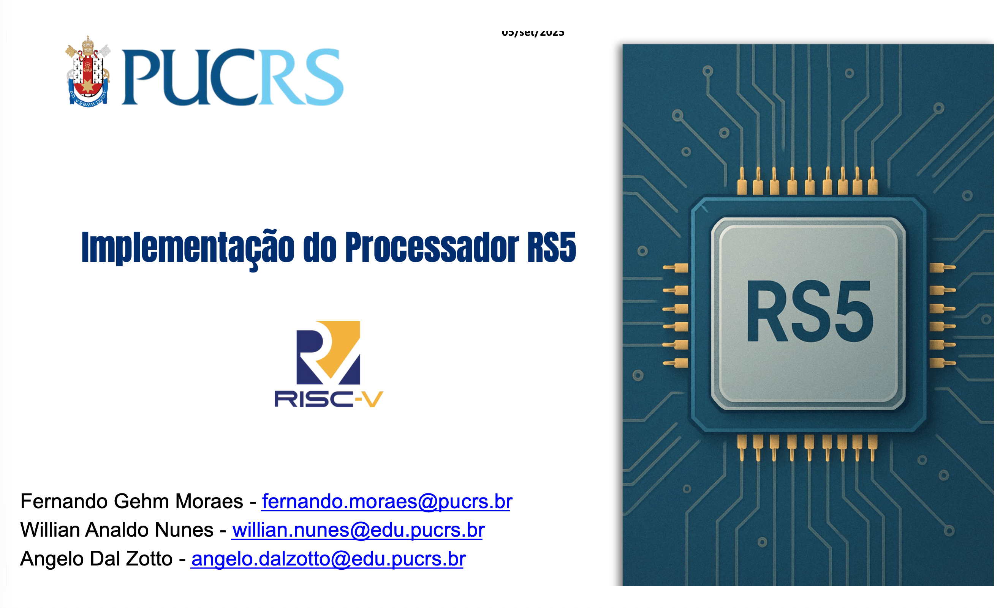
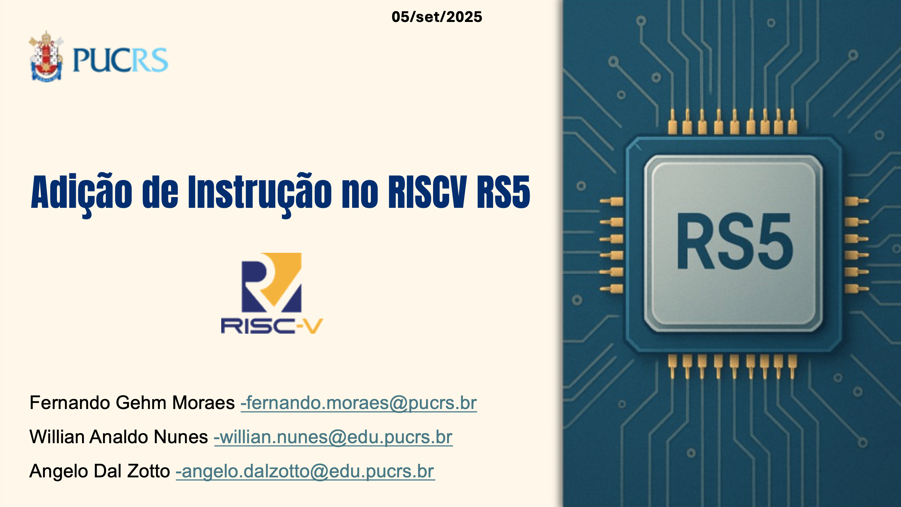
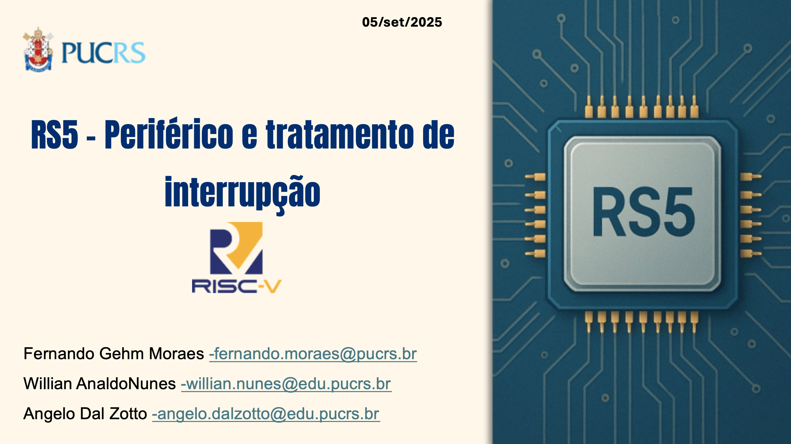

# RS5

**RS5** is a parameterizable, 4-stage pipelined RISC-V processor written in SystemVerilog, developed at the [Hardware Design Support Group (GAPH)](https://nsesd.pucrs.br/), PUCRS, Brazil.

[](riscof/README.md)
[](proto/RS5)
[](proto/RS5_SUME)
[](https://www.linkedin.com/feed/update/urn:li:activity:7470952399667425280/)


[](LICENSE)

## Table of Contents

- [RS5](#rs5)
  - [Table of Contents](#table-of-contents)
  - [Feature overview](#feature-overview)
  - [Simulation Quick Start](#simulation-quick-start)
    - [Requirements](#requirements)
    - [Build the test application](#build-the-test-application)
    - [Simulate with Verilator](#simulate-with-verilator)
    - [Simulate with Modelsim/Questa](#simulate-with-modelsimquesta)
    - [Simulate with Xcelium](#simulate-with-xcelium)
  - [FPGA Prototyping](#fpga-prototyping)
    - [Prototyping steps](#prototyping-steps)
  - [Architectural compliance (RISCOF)](#architectural-compliance-riscof)
  - [Tutorials (in Portuguese)](#tutorials-in-portuguese)
  - [Cite this work](#cite-this-work)
  - [Acknowledgements](#acknowledgements)

---

## Feature overview

| Feature | Details |
|---|---|
| Base ISA | RV32I |
| Privilege modes | Machine mode (M-mode) and User mode (U-mode) |
| Interrupt controller | optional [SiFive-compliant](https://github.com/riscv/riscv-plic-spec) [PLIC](rtl/plic.sv) |
| Machine timer | optional [mtimer](rtl/rtc.sv) |

| Extension type | Available extensions |
|---|---|
| Integer extensions | Zicond; Zicsr (always enabled); Zihpm |
| Multiply/divide extensions | M or Zmmul (multiply subset) |
| Atomic extensions | A, Zalrsc (conditional subset), or Zaamo (AMO subset) |
| Compressed extensions | C and Zcb (additional compressed) |
| Cryptography | Zkne (AES), Zbkb (bit-manip), Zknh (SHA2), Xkyber(Kyber) |
| Vector extension | Zve32x and Zvl64b subsets (configurable VLEN, LLEN) |
| Non-standard | Xosvm (offset and size virtual memory support) |

| Parameter | Details |
|---|---|
| Branch prediction | Optional static branch prediction for immediate branches at decode stage |
| Data forwarding | Optional forwarding from execution result or memory read. Register writeback is always forwarded. |
| Instruction buffering | Optionally fetches while pipeline is stalled |

Optional features are configurable through parameters in [rtl/RS5.sv](rtl/RS5.sv).
See [docs/README.md](docs/README.md) for details on the core implementation, parameters and extensions.

---

## Simulation Quick Start

### Requirements

It is possible to evaluate RS5 using only open source tools:

- [Verilator](https://verilator.org)
- [RISC-V toolchain](https://github.com/gaph-pucrs/Memphis-V/blob/master/docs/riscv.md)

RS5 also supports simulation with the following commercial tools:
- Modelsim/Questa
- Xcelium

### Build the test application

The default test application is a set of tests from the [riscv-arch-test](https://github.com/riscv/riscv-arch-test).
You need to build the application before running the simulation:

```bash
make -C app/riscv-tests
```

### Simulate with Verilator

This verilates and runs the default application.
Results are written to `sim/results/Output.txt` (simulation output) and `sim/results/Report.txt` (profiling).

```bash
make -C sim
```

### Simulate with Modelsim/Questa

```bash
cd sim
vsim -c -do sim.do
```

### Simulate with Xcelium

```bash
cd sim
xrun -f sim.xrun
```

---

## FPGA Prototyping

RS5 supports FPGA prototyping on the following platforms:

- Digilent Nexys A7
- NetFPGA SUME

Each platform has its own Vivado project, top-level RTL and Makefile under
`proto/`, while the FPGA automation is shared between platforms.

### Quick start

Select the target platform:

#### Digilent Nexys A7

```bash
cd proto/RS5_NEXYS
```

#### NetFPGA SUME

```bash
cd proto/RS5_SUME
```

The default application is `coremark`. To build another application, use the
`APP` variable.

For example, to build `hello` up to FPGA implementation:

```bash
make APP=hello
```

This is equivalent to:

```bash
make impl APP=hello
```

To generate the bitstream:

```bash
make bit APP=hello
```

To generate the bitstream if necessary and program the FPGA:

```bash
make flash APP=hello
```

UART output can be monitored with:

```bash
make monitor
```

The most commonly used targets are:

```text
make app        Build the selected application
make mem        Generate the BRAM initialization image
make prepare    Prepare the Vivado project and IPs
make synth      Run synthesis
make impl       Run implementation (default)
make bit        Generate the bitstream
make flash      Program the FPGA
make monitor    Open the UART serial monitor
make clean      Remove generated build files
```

For the complete FPGA prototyping documentation, including project structure,
Vivado requirements, memory initialization, IP management, manual Vivado flow,
build dependencies and platform-specific details, see
[`proto/README.md`](proto/README.md).

## Architectural compliance (RISCOF)

Compliance testing against the RISC-V formal spec is available in [riscof/](riscof/).
See [riscof/README.md](riscof/README.md) for setup.

---

## Tutorials (in Portuguese)

These tutorials present an overview of RS5, including adding instructions to the pipeline and configuring peripherals. These tutorials were adapted from their presentation at [INOVA-ME](https://www.inf.ufrgs.br/inova-me/) 2025.

<p align="center">
    <a href="docs/tutorials/RS5_1.pdf"></a>
    <a href="docs/tutorials/RS5_2.pdf"></a>
    <a href="docs/tutorials/RS5_3.pdf"></a>
</p>

---

## Cite this work

RS5 was presented at LASCAS'2024. Please cite this work when referring to RS5.

```
Nunes, W. A., Dal Zotto, A. E., Borges, C. d.S., and Moraes, F. G. (2024). RS5: An Integrated Hardware and Software Ecosystem for RISC-V Embedded Systems. In IEEE Latin America Symposium on Circuits and Systems (LASCAS), pages 1--5. https://doi.org/10.1109/LASCAS60203.2024.10506171.
```

---

## Acknowledgements

Other work were published regarding RS5 implementation:

* Vector extensions
    ```
    Nunes, W. A., dos Santos, A. V. C., and Moraes, F. G. (2025). Accelerating Machine Learning with RISC-V Vector Extension and Auto-Vectorization Techniques. In IEEE International Symposium on Circuits and Systems (ISCAS), pages 1--5. https://doi.org/10.1109/ISCAS56072.2025.11043225.
    ```
* Zkne implementation
    ```
    Gewehr, C. G. de A., and Moraes, F. G. (2023). Improving the Efficiency of Cryptography Algorithms on Resource-Constrained Embedded Systems via RISC-V Instruction Set Extensions. In SBC/SBMicro/IEEE/ACM Symposium on Integrated Circuits and Systems Design (SBCCI), pages 1--5. https://doi.org/10.1109/SBCCI60457.2023.10261964.
    ```
* Initial RS5 design
    ```
    Nunes, W. A. (2022). PUC-RS5: A RISC-V processor core for embedded uses. Bachelor's thesis, Pontifical Catholic University of Rio Grande do Sul. https://repositorio.pucrs.br/dspace/handle/10923/26400.
    ```
