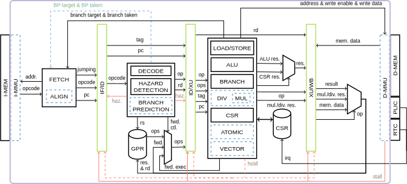

# RS5

## Description

RS5 is a processor that implements the RISC-V 32 bits integer Module (RV32I) alongside the Zicsr Extension and the Machine Mode of the RISC-V Privileged Architecture. It is written in the SystemVerilog Hardware Description Language (HDL) and implements the following interface:

This project was designed at the Hardware development support Group (GAPH) of the School of Technology, PUCRS, Brazil.

The processor is a 4 stage pipeline, synchronized to the rising edge of the clock. The stages are:

- Fetch: Contains the Program Counter (PC) Logic, that indexes the Instruction memory.
- Decode and Operand Fetch: Decodes the instruction, extracting its type, format, operation and register addresses, also Fetches the operands in the register Bank and performs data hazard detections. When a hazard is detected, it inserts NOP instructions (bubbles) until the conflict become resolved.
- Execute: Performs the given operation on the received operands. Holds an Arithmetic and Logic Unit, a CSR access unit, a Memory Load and Store unit and a Branch unit.
- Retire: Performs the write-back of the results of the instruction, it can be either the result from execute stage or the data read from memory.

    

    > RS5 BLOCK DIAGRAM.

## RTL and Processor Organization

This processor organization is an evolution of an Asynchronous RISC-V High-level Functional Model written in GO language. That can be found in the [ARV Go High-level Functional Model](https://github.com/marlls1989/arv) repository.

- First Stage - Instruction Fetch:
This stage is the Instruction Fetch Stage and is implemented by the [Fetch Unit](https://github.com/gaph-pucrs/RS5/blob/master/rtl/fetch.sv), this unit contains the Program Counter (PC) logic, the value contained in this register is used to index the instruction memory, at each clock cycle it is updated, it can be updated to the next instruction address (PC+4), or a branch address, it can also maintain the same address in case of a bubble being inserted due to a detection of a data hazard or memory stall. The jump/branch prediction policy is "never taken".
Each instruction that leaves the first stage is linked to a Tag that will follow the instruction until its retirement. This Tag is a number that indicates the "flow/context" of that instruction. Every time a jump/branch occurs the tag will be increased meaning that the fetched instructions now belong to a new flow.

- Second Stage - Instruction Decode:
It comprehends the [Decoder Unit](https://github.com/gaph-pucrs/RS5/blob/master/rtl/decode.sv), It is responsible for the generation of the control signals, based on the instruction object code fetched by the previous stage. It identifies the instruction operation (e.g. addi, bne) that is implemented in a one-hot encoding. It also decodes the instruction format (e.g. Immediate, Branch). Also sends to the register bank the read addresses that are directly extracted from the instruction object code, the object code is also used for the immediate operand extraction, based on the instruction format. The instruction format also determines the operands that will be sent to the next stage. The Data Hazard Detection mechanism is implemented by this unit, it tracks the Destiny register (regD) of the instruction that currently is in execute stage, this register is called the "blocked register", its value is updated every time that an instruction leaves the stage. A Data Hazard is detected when the instruction being processed by the decoding stage has an operator that must be read from the blocked register, this issues a signal called "hazard" that indicates that a bubble must be issued until the data conflict gets resolved. This unit also looks for data memory hazards, cases where a read is performed right after a write in the memory.
The locked register value is used for indexing the register that must receive the write-back data from the retire unit.

- Third Stage - Instruction Execution:
This stage comprehends the Instruction Execution Stage that is implemented by the [Execute Unit](https://github.com/gaph-pucrs/RS5/blob/master/rtl/execute.sv), It implements an Arithmetic Logic Unit (ALU) responsible for calculations, and it also has a Branch Unit that makes the decision of branching based on instruction operation and operands. Also implements the Memory Load and Store mechanism. Lastly, it implements the CSR access logic.
The operations are performed based on Tag comparisons between this unit's tag and the instruction tag, if they mismatch the instruction is killed and its operation is not performed. A performed branch causes the internal tag to be increased, causing the tag mismatch on the following instructions until an instruction fetched from the new flow arrives with the updated tag.

Fourth Stage:
This is the last stage and it is responsible for the write-back of the instructions data, it is implemented by the [Retire Unit](https://github.com/gaph-pucrs/RS5/blob/master/rtl/retire.sv) and is responsible for closing the loops. It performs the write-back on the register bank. It also receives the data read from memory and process it based on instruction operation, then it decides which data should be sent to the register bank, either the data from memory or the data from execute unit.

### The three loops

The Control of the processor core flow is made by three main loops:

1) The first loop is the instruction context/flow loop that comprehends the first three stages of the processor core, it starts in the first stage with the instruction fetch and its tag association and goes through until the third stage where it is closed by the jump control signals that are sent back to the first stage, this loop is implemented by the Tag system that manages the context/flow of the instructions, it is updated every time a jump/branch occurs.

2) The second loop comprehends the second, the third and the fourth stage, it is called the Data loop and implements the data write-back in the register bank. It is closed by the Retire Unit and also implements a data forwarding mechanism.

3) The third loop comprehends the data hazard conflict detection mechanism that is implemented by the Instruction decode stage that keeps track of the register with pending write and the closure of the loop is performed by the value stored in the loop being used for addressing the register that will receive the write-back.

### Memory Interface

The processor implements The memory interface depicted in the above image. The Memory is a True dual port RAM where one port is used as a read-only port for instruction fetching and the other port is used for read and write operations.

## Requirements

To perform code compilation the RISC-V toolchain is needed. The toolchain has a compiler that performs the compilation of the applications codes that are written in C language and generates a binary, this binary is the entry of the processor simulation. The applications are located in [app/](https://github.com/gaph-pucrs/RS5/tree/master/app).

The installation of the toolchain is only needed if you want to compile new applications or change parameters in the given ones.

To install the Toolchain a guide and a script are provided inside the folder [tools/riscv-toolchain](https://github.com/gaph-pucrs/RS5/tree/master/tools/riscv-toolchain).

To perform the simulation you must have a HDL simulator (e.g. XCELIUM, MODELSIM). To perform the simulation of a specific application, you must edit the binary input file in the [RAM_mem.sv](https://github.com/gaph-pucrs/RS5/blob/master/sim/RAM_mem.sv). The testbench and the ram implementation are located in the [/sim](https://github.com/gaph-pucrs/RS5/tree/master/sim) folder. Once the desired application is selected and the testbench is pointing to it, then you are able to perform the simulation using the HDL simulator.

## Applications
In this repository, some applications that were used to validate the processor are provided. The source codes of the applications are located in the [app/](https://github.com/gaph-pucrs/RS5/tree/master/app) folder, all of them can be built using their own Makefile, which will generate the output binary of each application.

### Coremark
The [Coremark](https://github.com/gaph-pucrs/RS5/tree/master/app/coremark) is a Benchmark application that was developed by EEMBC, it was ported to run in RS5 and can be compiled by simply running the command "make" inside Coremark's folder, it will then generate a binary called "coremark.bin". In our processor, since we have only one thread we are running the coremark for only one iteration.

### RISCV Tests
The [riscv-tests](https://github.com/marlls1989/riscv-tests/tree/159079a82ecc332ce32e5db84aff9f814dc7ec12) is the "Berkeley Suite" that was developed to validate the RISC-V implementations. It tests all the instructions by running comparisons between the expected results and those generated by the Unit under verification.

### Sample Codes
The [samplecode](https://github.com/gaph-pucrs/RS5/tree/master/app/samplecode) folder contains some simple applications that were used to test some functionalities in the processor. These applications use BareOS, which is a simple Operational System. All the applications are compiled at once by simply running the "make" command. To add more applications you must insert in the folder with the source code in C language and then edit the [Makefile](https://github.com/gaph-pucrs/RS5/blob/master/app/samplecode/Makefile) so it also compiles the new application, to do that, is just needed to edit line 13 of the Makefile by adding the name of the new application on the "PROGNAME" variable, that is a list of the applications that will be made.

The applications provided are:
1. Dummy - Test the halt function of the processor.
2. Hello World - Test the "stdout" of the processor, by printing "Hello World".
3. Hanoi Tower - Implements a Hanoi Tower solving algorithm.

### Prototyping

This processor is designed to be prototyped in FPGA environments. In the [proto/](https://github.com/gaph-pucrs/RS5/tree/master/proto) folder there is the designed environment for prototyping. The prototyping was made in a Vivado environment and the folder includes a Vivado ".xpr" project that includes all the required files for replication.

The prototyping Environment is shown in the figure below. This environment is implemented by the [RS5_FPGA_Platform.sv](https://github.com/gaph-pucrs/RS5/blob/master/proto/RS5_FPGA_Platform.sv) module. This module instantiates the RS5 core and implements the memory using Block Rams, the RS5 also counts with a compiler "ifdef" macro to use a LUT RAM Register Bank to optimize FPGA resource usage. There is a module that implements the core peripherals that will be discussed in the next subsection. The peripheral access is made through the data memory interface and the peripherals are mapped in memory in addresses that are higher than the memory length, that in this case is 64Kbs.

> RS5 Environment DIAGRAM.

## Peripherals

The peripherals module implements some components that are depicted in the image below.
The peripherals can issue interruptions that will request attention from the processor core through an interrupt request signal (IRQ).
The peripheral module is composed of two main interfaces, the first one is for data access and is used for reads and writes in peripherals and the second one is the one related to interruption request generation.
The RS5 counts with a Real-Time clock that can be read by direct access and also raises an interrupt every 5 seconds.
In the FPGA a physical button is mapped to an environment entry that will detect the button press event and raise an interrupt request for the core.
The Environment counts with a universal asynchronous receiver-transmitter (UART) that enables the processor to communicate with other devices through serial protocols. This UART is mapped to the serial that is connected to the host computer and implements the standard output for print operations. To increase throughput the serial is preceded by a FIFO buffer.

> RS5 Peripherals DIAGRAM.

### Trap treatment flow

> RS5 Trap treatment flow Diagram.

## How to Simulate

The simulation is performed inside the [/Sim Folder](https://github.com/gaph-pucrs/RS5/blob/master/sim/). This folder contains the [testbench.sv](https://github.com/gaph-pucrs/RS5/blob/master/sim/testbench.sv) that instantiates the processor core and runs the simulation. It also has a wave configuration file and some scripts for simulating via the command line in different simulators.

Initially it would be necessary to have the desired application compiled as a binary file, for that you should have the Risc-V Toolchain installed. The section "Requirements" describe how you can install the toolchain in your system. To compile the binary file you should run the makefile on the desired folder, there are several applications provided inside the [App Folder](https://github.com/gaph-pucrs/RS5/blob/master/app/) as described in the above "Applications" section.

After the binary file is compiled, you should edit the binary file path on the [RAM_mem.sv](https://github.com/gaph-pucrs/RS5/blob/master/sim/RAM_mem.sv) file. This module initializes the RAM with the specified binary file contents. The repository file points to the Berkeley suite application that tests every instruction of the core using relative paths.

On the [/Sim Folder](https://github.com/gaph-pucrs/RS5/blob/master/sim/) with the correct path specified on the RAM, you are now able to simulate the core on the following simulators:

For Modelsim/Questa, the [sim.do](https://github.com/gaph-pucrs/RS5/blob/master/sim/RAM_mem.sv) script file is provided and simplifies the process of simulating using the command line. for that you can just run the command: `vsim -c -do sim.do`.

For Xcelium simulator, the [sim.xrun](https://github.com/gaph-pucrs/RS5/blob/master/sim/RAM_mem.sv) script file is provided. To run via Xcelium you can run the command `xrun -f sim.xrun`.

For Verilator you can run the commands: `verilator --cc testbench.sv --exe tb_top_verilator.cpp --build --Wall` followed by `./obj_dir/Vtestbench`.
Or simply run `make` to verilate and simulate.

## How to Prototype on FPGA

The [Proto Folder](https://github.com/gaph-pucrs/RS5/blob/master/proto/) provides all the files needed for the FPGA prototype. To load the application on the Block RAM (BRAM) run you will need the application binary file as described in the previous section. The BRAM is loaded using a ".coe" file. To generate the coe file a python script is provided in the [init_mem.py](https://github.com/gaph-pucrs/RS5/blob/master/proto/init_mem.py) file. The script input file path should point to the application binary file, after running the script via the `python3 init_mem.py` command it will generate the ".coe" file for the given application, you can also edit the output ".coe" file name.

A Vivado project is provided in the [RS5.xpr](https://github.com/gaph-pucrs/RS5/blob/master/proto/RS5/RS5.xpr) file that can be imported into VIVADO. This project already points to all the processor, environment and FPGA IP files. After opening the project the processor should be ready for synthesis and implementation in a Xilinx Nexys A7 FPGA board. The ".coe" file should is automatically loaded by the BRAM IP but **you must reset output products** in Vivado every time you re-generate the ".coe" file. After running the synthesis you can generate the bitstream and then you should connect the FPGA board to your computer and then program the device, after these steps then the processor will be running in the FPGA board. To be able to capture the processor output you can either use VIVADO tools or use a serial port emulator such as Teraterm or PUTTY on Windows or running the `tio /dev/ttyUSB1 -b 115200 --map ICRNL,INLCRNL` command on Linux.

## References

1. [W. A. Nunes, A. E. Dal Zotto, C. da Silva Borges and F. G. Moraes, "RS5: An Integrated Hardware and Software Ecosystem for RISC- V Embedded Systems," 2024 IEEE 15th Latin America Symposium on Circuits and Systems (LASCAS), Punta del Este, Uruguay, 2024, pp. 1-5](https://ieeexplore.ieee.org/abstract/document/10506171)
