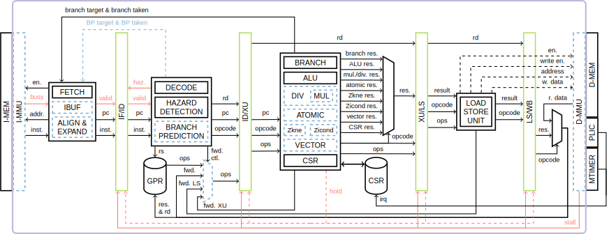
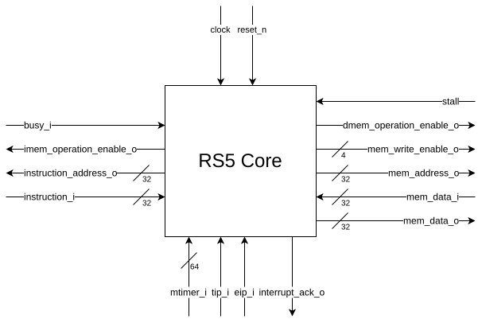

# RS5 Documentation

This folder contains documentation for RS5 implementation, extensions and parameters.
For a general overview of the processor, see the [main README](../README.md).

## Table of Contents

- [Architecture Overview](#architecture-overview)
- [Processor Interface](#processor-interface)
- [Extensions](#extensions)
- [Parameters](#parameters)

---

## Architecture Overview

RS5 has a 4-stage pipeline.

    

| Stage | Module | Description |
|---|---|---|
| Fetch | [fetch](../rtl/fetch.sv) | Program counter logic, instruction memory access |
| Decode | [decode](../rtl/decode.sv) | Instruction decoding, register file read, data hazard detection |
| Execute | [execute](../rtl/execute.sv) | ALU, branch, CSR access |
| Load/Store | [RS5 (top-level)](../rtl/RS5.sv) | Memory access |

| Option | Module | Description |
|---|---|---|
| IBUF / ALIGN & EXPAND | [fetch](../rtl/fetch.sv)/[decompresser](../rtl/decompresser.sv) | Memory alignment control and instruction buffering for compressed instructions support |
| BRANCH PREDICTION | [fetch](../rtl/fetch.sv)/[decode](../rtl/decode.sv)/[execute](../rtl/execute.sv) | Static branch prediction for immediate-target branch resolution in decode stage instead of execute stage |
| Extensions | [execute](../rtl/execute.sv) and several others | Most extensions use the **hold** signal to perform multi-cycle operations |
| MMU | [mmu](../rtl/mmu.sv) | Implement the Xosvm extension |

**Hazard handling:** data and control hazards insert bubbles; busy instruction memory also insert bubbles; busy data bus stalls the pipeline through the **stall** signal, although instruction fetch can still occur through *IBUF*.

---

## Processor interface

The top-level module [RS5](../rtl/RS5.sv) provides the parameter configuration and the RS5 interface.
The interface contains four signal groups:

* Global signals: `clk`, `reset_n` (asynchronous), and `sys_reset_i` (synchronous);
* Instruction memory: `busy_i`, `imem_operation_enable_o`, `instruction_address_o` and `instruction_i`;
* Data bus: `stall`, `dmem_operation_enable_o`, and `mem_*` signals;
* Peripherals: `tip_i` for timer interrupts, `eip_i` for external interrupts optionally managed through PLIC, `interrupt_ack_o`, and `mtime_i` for optional cycle counter through MTIMER/RTC.

    

---

## Extensions

Extensions are enabled via parameters in [../rtl/RS5.sv](../../rtl/RS5.sv).

| Extension | Parameter | Description | Docs |
|---|---|---|---|
| Zicsr | always enabled | Control and status register access | — |
| M | `MULEXT = MUL_M` | Integer multiply and divide | — |
| Zmmul | `MULEXT = MUL_ZMMUL` | Multiply-only subset of M | — |
| A | `AMOEXT = AMO_A` | Atomic memory operations | — |
| Zaamo | `AMOEXT = AMO_ZAAMO` | AMO subset of A | — |
| Zalrsc | `AMOEXT = AMO_ZALRSC` | LR/SC subset of A | — |
| C | `COMPRESSED = 1` | Compressed (16-bit) instructions | — |
| Zcb | `ZCBEnable = 1` | Additional compressed instructions (requires C) | — |
| Zicond | `ZICONDEnable = 1` | Integer conditional operations | — |
| Zihpm | `HPMCOUNTEREnable = 1` | Hardware performance-monitoring counters | — |
| Zkne | `ZKNEEnable = 1` | AES encryption (scalar, 32-bit) | — |
| V (Zve32x / Zvl64b) | `VEnable = 1` | Vector extension (configurable VLEN, LLEN) | — |
| Xosvm | `XOSVMEnable = 1` | Offset and size virtual memory (non-standard) | [Xosvm.md](extensions/Xosvm.md) |

---

## Parameters

Non-extension parameters configure processor behaviour and target environment.

| Parameter | Type | Default | Description |
|---|---|---|---|
| `Environment` | `environment_e` | `ASIC` | Target technology: `ASIC` or `FPGA` (selects LUT-RAM register bank on FPGA) |
| `START_ADDR` | `logic [31:0]` | `0x00000000` | Reset/boot address loaded into the program counter on reset |
| `BUS_WIDTH` | `int` | `32` | Data bus width in bits |
| `IQUEUE_SIZE` | `int` | `2` | Instruction buffer depth; allows fetch to continue while the data bus is stalled |
| `BRANCHPRED` | `bit` | `1` | Enable static branch prediction (resolves immediate-target branches at decode instead of execute) |
| `FORWARDING` | `bit` | `1` | Enable data forwarding from execute result and memory read; writeback forwarding is always active |
| `VLEN` | `int` | `256` | Vector register length in bits (effective when `VEnable = 1`) |
| `LLEN` | `int` | `32` | Vector memory access lane width in bits (effective when `VEnable = 1`) |
| `DEBUG` | `bit` | `0` | Dump register file contents to `DBG_REG_FILE` at end of simulation |
| `DBG_REG_FILE` | `string` | `./debug/regBank.txt` | Output path for register file debug dump |
| `PROFILING` | `bit` | `0` | Enable instruction profiling report written to `PROFILING_FILE` |
| `PROFILING_FILE` | `string` | `./debug/Report.txt` | Output path for profiling report |

